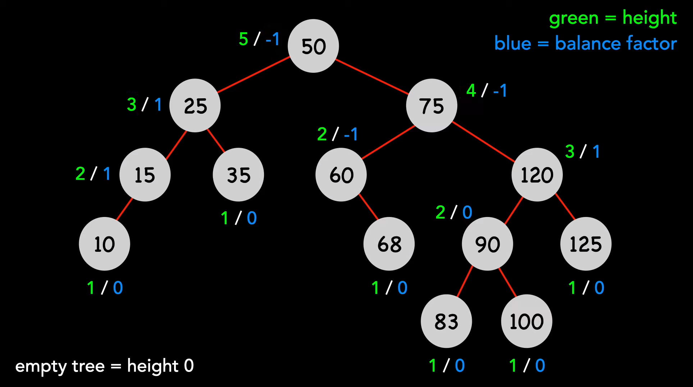
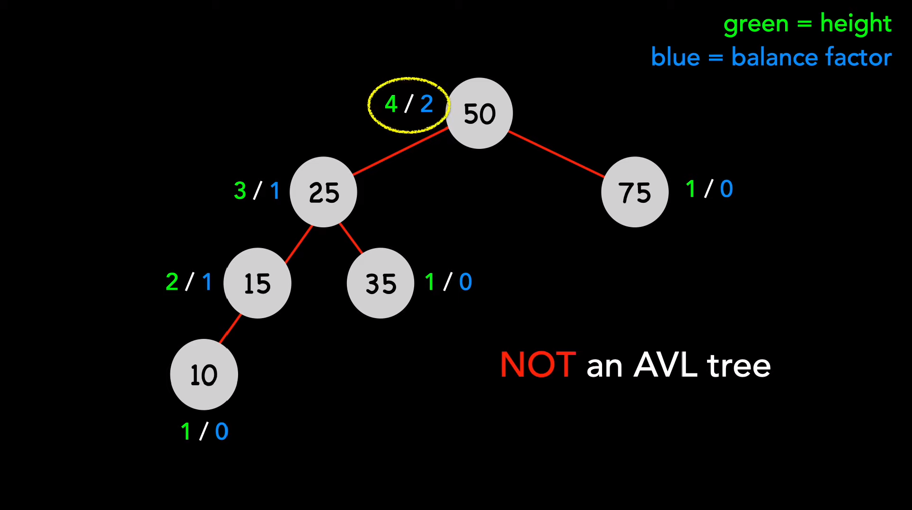
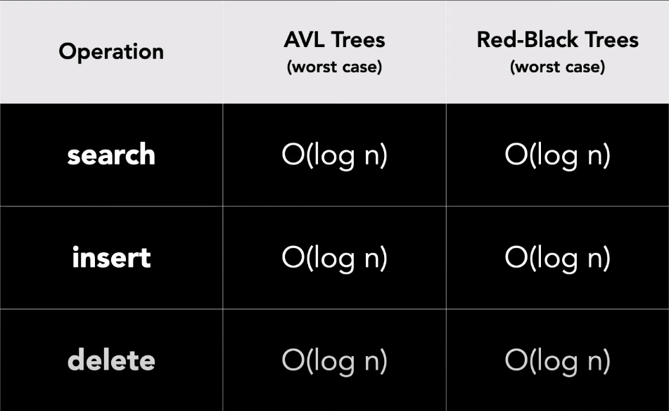
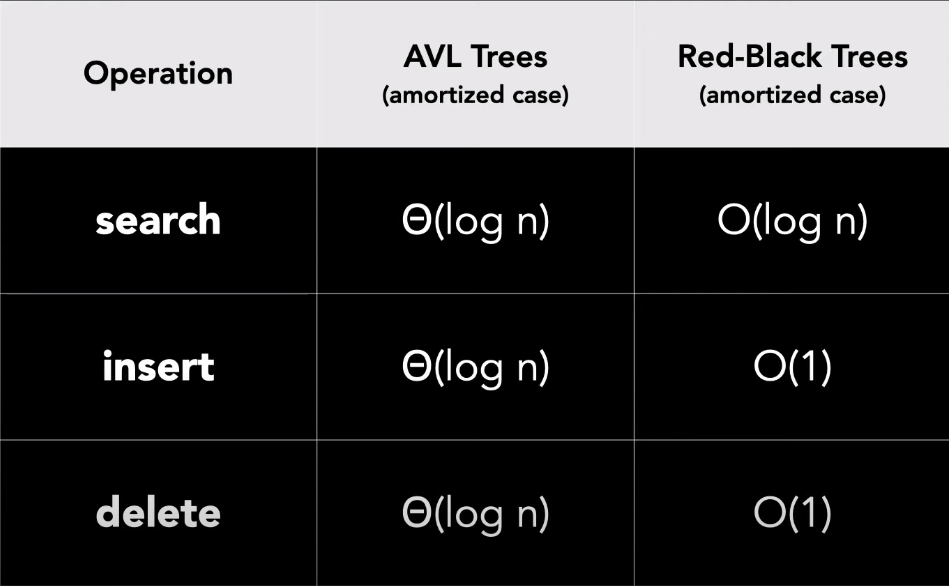

# AVL Tree
Self-balancing binary search tree
Named after Adelson-Velsky and Landis
Similar to red-black trees
Perform fixes after insert and delete
Height balanced
Guarantess specific time complexities for operations
O(log n) - search , insert and delete

Height = number of nodes on the longest path from the root to a leaf
For any node, the height of its two subtrees differs by at most one
Balance factor = height of the left subtree - height of right subtree
This means that valid values for balance factor are -1, 0, 1
Empty tree = height 0
Leaf = heigh 1

## AVL vs Red-Black tree

AVL trees are better choice if use case is lookup-intesive because they are more stricly balanced
log2(n)
| Height of AVL             | Height of RB              |
| ------------------------- | ------------------------- |
| 1.44 * log2(n) | 2 * log2(n)    |

**If insertions often occur in sorted order, AVL tress excel when later assesses tend to be random.**

## Examples

### AVL Tree

### NOT AVL Tree
Balance factor is 2

## Time Complexity

### Worst

### Amortized

## Links
[UW-Madison Data Structures 2011](https://web.archive.org/web/20190731124716/https://pages.cs.wisc.edu/~ealexand/cs367/NOTES/AVL-Trees/index.html)
[Ben Plaff, BST perfomance analysis] (https://web.stanford.edu/~blp/papers/libavl.pdf)